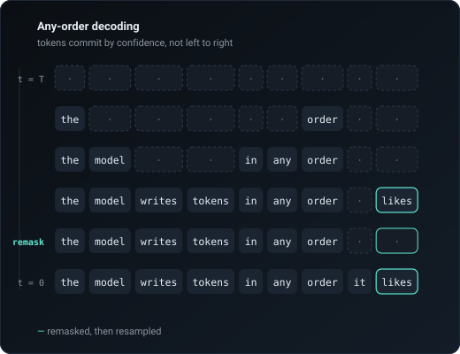

<picture>
  <source media="(prefers-color-scheme: dark)" srcset="assets/hero-dark.svg">
  <source media="(prefers-color-scheme: light)" srcset="assets/hero-light.svg">
  
</picture>

  
  &nbsp;
  
  &nbsp;
  

  <b>I work on generative models (flow matching, discrete diffusion, GFlowNets) and on the reinforcement learning that steers them.</b> 
  MSc at UCL (predicted Distinction) · First-class BSc from KCL · two NeurIPS workshop submissions in preparation

 

## Sample work

### Flow matching: what the coupling costs you

  

Flow matching pins down the marginals but leaves the pairing of noise to data
free. Both panels transport the same Gaussian onto the same molecule with the
same seed; only the coupling differs. Colour tracks each particle's starting
angle, so the shredded colour wheel on the left *is* the conditional averaging
the network is forced to do and it is why that model needs far more
integration steps to sample cleanly. Re-rendered weekly by CI, inference only.

**PyTorch · minibatch OT · rdkit · GitHub Actions** &nbsp;
<a href="https://github.com/ak0345/ak0345/tree/main/flow-matching-2d">Code, derivation and the NFE ablation →</a>

<table>
<tr>
<td width="50%" valign="top">

### Flow matching on a manifold

  

Riemannian flow matching on $S^2$: geodesic probability paths, a tangent-space
network, and integration by exponential map. Uniform on the sphere to twelve von
Mises–Fisher modes.

**Riemannian geometry · PyTorch**

<a href="https://github.com/ak0345/ak0345/tree/main/flow-matching-sphere">Read the code →</a>

</td>
<td width="50%" valign="top">

### Remasking Discrete Diffusion, live

<picture>
  <source media="(prefers-color-scheme: dark)" srcset="assets/remdm-preview-dark.svg">
  <source media="(prefers-color-scheme: light)" srcset="assets/remdm-preview-light.svg">
  
</picture>

An interactive Space that writes text **out of order** — committing
high-confidence tokens first, then remasking and resampling the ones it got
wrong, side by side with left-to-right decoding.

**Discrete diffusion · Gradio · Hugging Face Spaces**

</td>
</tr>
</table>

 

## Research

<table>
<tr><td width="24%" valign="top"><b>MSc Dissertation</b> UCL AI Centre Prof. Brooks Paige</td>
<td valign="top">

**Where does reward steering stop working on a frozen molecular generative model?**
Trained logit and hidden-state GFlowNet guides under RTB/DB objectives against
full-weight and LoRA fine-tuning on Quetzal / GEOM-Drugs, evaluated on GuacaMol
MPO. Found a hard ceiling on achievable reward set by the pretraining
distribution and identified the mechanism that enforces it.

</td></tr>

<tr><td valign="top"><b>Discrete Diffusion Planners</b> Supervised by Jack Parker-Holder Google DeepMind / UCL</td>
<td valign="top">

ReMDM as a **non-myopic trajectory planner** across MiniHack and Craftax: an
order-of-magnitude improvement over PPO, DQN and Decision Transformer baselines,
with the strongest zero-shot OOD transfer of the set. A 25-condition ablation
suite isolated a *double intractability* blocking RL fine-tuning of masked
discrete diffusion which is an analytically intractable log-likelihood, compounded by
non-discriminative reward surrogates under sparse rewards.

</td></tr>

<tr><td valign="top"><b>BSc Dissertation</b> KCL · First-class</td>
<td valign="top">

Built a full Settlers of Catan environment from scratch in PyTorch and trained
DQN agents by self-play, scaling from a Mini-Catan simulator to the complete
game. 88.9% win rate against random opponents and more interestingly, a
characterisation of *how* it collapses against stronger play, which is a
readable argument for learned world models.

</td></tr>
</table>

 

## Elsewhere

**Pakistan National Disaster Management Authority** — hybrid LSTM+CNN models
predicting urban smog from three years of satellite air quality data (≈8% MSE),
on `xarray`/`rioxarray` pipelines handling billions of points. Deployed in
NDMA's real-time alert system; now expanding from city-level models to a
nationwide spatio-temporal framework.

 

## Toolbelt

  
  
  
  
  
  
  
  
  
  

Also: mixed-precision and distributed training, Bayesian deep learning, R, C++, Java.

 

---
