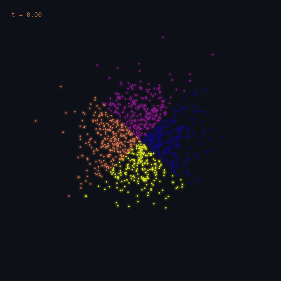

# Flow Matching in 2D

Simulation-free flow matching that transports a standard Gaussian onto a
4-mode Gaussian mixture. A GitHub Action re-renders the transport every day
with a fresh batch of particles, so the animation on the profile is always
freshly generated rather than a static asset.

<p align="center">
  
</p>

## The objective

Rather than simulating an SDE, we regress the velocity field of a linear
probability path between the base distribution $p_0$ and the target $p_1$.
With independent coupling $x_0 \sim p_0$, $x_1 \sim p_1$, and $t \sim U[0,1]$:

$$x_t = (1 - t)\,x_0 + t\,x_1, \qquad
\mathcal{L}(\theta) = \mathbb{E}\left\lVert v_\theta(x_t, t) - (x_1 - x_0) \right\rVert^2$$

The conditional target $x_1 - x_0$ is constant along each path, which is why
no simulation is needed at training time — every gradient step is a single
forward pass on a freshly sampled triple.

## Model

| | |
| --- | --- |
| Architecture | 4-layer MLP, width 256, SiLU |
| Time conditioning | Sinusoidal embedding (128-dim) → 2-layer MLP, concatenated with $x$ |
| Parameters | ~300k |
| Sampling | Euler integration of $\dot{x} = v_\theta(x, t)$, 100 steps |

## Usage

```bash
pip install -r requirements.txt

# Train once (~1 min on CPU) and commit the checkpoint.
python train.py --steps 6000 --out checkpoints/vector_field.pt

# Inference only - this is what CI runs daily.
python render.py --checkpoint checkpoints/vector_field.pt --out ../assets/flow_dark.gif
```

`render.py` draws a new seed on every run, so each day's GIF shows a different
set of particles being transported by the same learned field.

## Files

| File | Purpose |
| --- | --- |
| `model.py` | `VectorField` network and checkpoint helpers |
| `data.py` | Base and target distribution samplers |
| `train.py` | Flow matching training loop |
| `render.py` | ODE solve + GIF rasterisation |
| `../.github/workflows/flow-daily.yml` | Scheduled render and commit |
